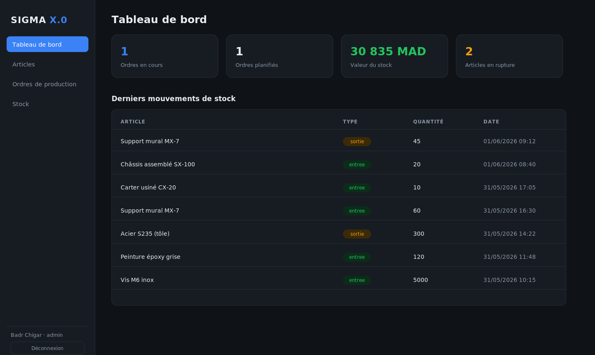
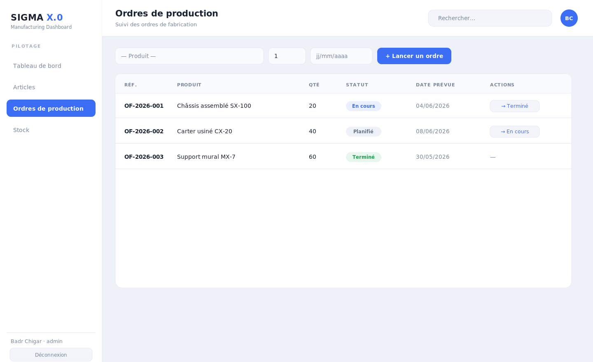

# SIGMA X.0 — ERP de gestion de production industrielle

Application full-stack de gestion de production : articles, ordres de fabrication, mouvements de stock et tableau de bord temps réel. Construite avec **React (Vite)**, **Node.js / Express** et **PostgreSQL**.

> Projet personnel de Badr Chigar — Ingénieur d'État en Informatique (EMSI Casablanca), développeur Full Stack Java/Spring & React.

## Captures d'écran

### Tableau de bord


### Ordres de production



## Fonctionnalités
- **Authentification** par JWT (rôles `admin` / `opérateur`).
- **Articles** : CRUD complet (matières premières & produits finis, prix, seuil de réappro).
- **Ordres de production** : création et suivi de statut (`planifié → en cours → terminé`).
- **Stock** : mouvements d'entrée/sortie, stock courant, alertes sous le seuil.
- **Tableau de bord** : KPIs et derniers mouvements.

## Stack
| Couche | Technologies |
|--------|--------------|
| Frontend | React 18, Vite, React Router |
| Backend | Node.js, Express, JWT, bcrypt |
| Base de données | PostgreSQL (`pg`) |

## Démarrage
### 1. Base de données
```bash
createdb sigma
psql sigma -f server/schema.sql
psql sigma -f server/seed.sql
```
### 2. Backend
```bash
cd server && cp .env.example .env
npm install && npm start      # http://localhost:4000
```
### 3. Frontend
```bash
cd client && npm install && npm run dev   # http://localhost:5173
```

### Compte de démo
`admin@sigma.ma` / `admin123` (admin)

## Licence
MIT © Badr Chigar
